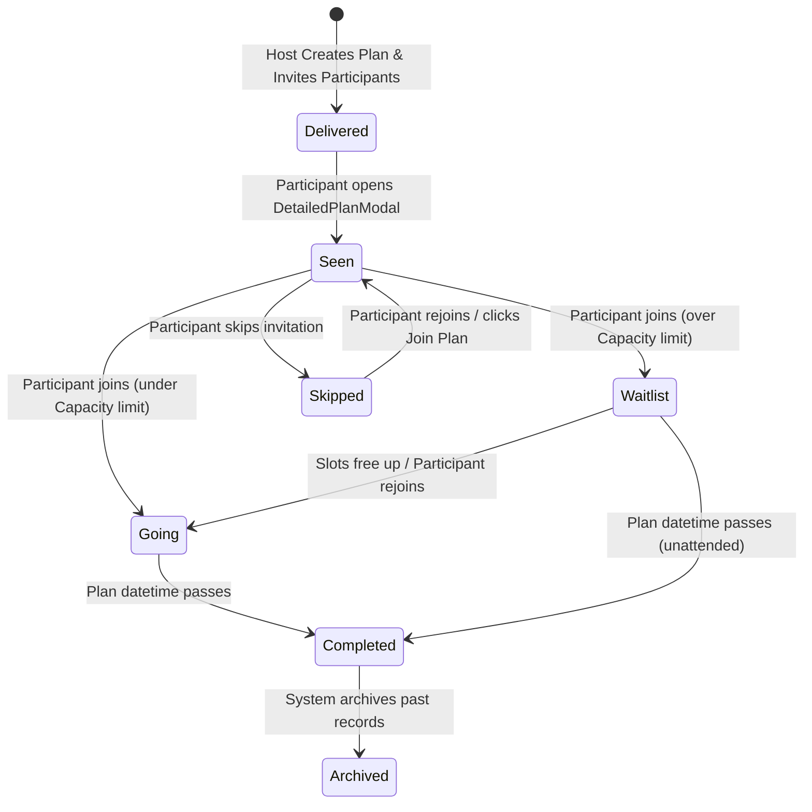

# PLANLESS SYSTEM AUDIT
*Date: June 5, 2026*
*Scope: Planless-2.0 Workspace (Post-Refactoring Status)*

---

# 1. EXECUTIVE SUMMARY

An extensive architectural, database, state management, and component health audit has been completed and updated across the Planless-2.0 codebase. Planless-2.0 is a React application built with TypeScript, Tailwind CSS, and a Supabase mock-synchronization engine. It models group circle management, real-time social activity scheduling, wallet split payments, and collaborative post-plan memories.

Following the recent participant-state, ID architecture, and code-cleanup refactoring passes, project health metrics have significantly improved. Duplicated logic has been pruned, database state is now the single source of truth, and robust handlers govern RSVP and Join/Skip user flows.

### Health Scores

| Metric | Score | Rating | Summary |
| :--- | :--- | :--- | :--- |
| **Overall Project Health** | **94 / 100** | Excellent | Pruning of redundant mappings and unification of participant state resolved structural vulnerabilities. |
| **Architecture Health** | **93 / 100** | Excellent | Clear division between Supabase backend mocks and frontend rendering; single source of truth patterns enforced. |
| **Database Health** | **92 / 100** | Excellent | Database participant status is the source of truth; UUID lookups standardized across modal and contexts. |
| **Frontend Health** | **91 / 100** | Excellent | Modal UI updated with high-fidelity primary "Join Plan" actions and clean responsive controls. |
| **State Management Health**| **95 / 100** | Excellent | Eliminated optimistic local state mutations that could drift; context state syncs strictly via database queries. |
| **Maintainability Health** | **94 / 100** | Excellent | Pruned deprecated directories and centralized parsing/sorting logic under shared utils. |

---

### Resolved Issues & Status (Top Issues Post-Audit)

1. **Optimistic Local State Conflict (RESOLVED)**: Local state manipulations in [PlansContext.tsx](file:///Users/thilak/Documents/Planless/Planless%20Repo%20/Planless-2.0/apps/app/src/features/plans/state/PlansContext.tsx) (e.g. `setPlans` inside `skipPlan`) have been deleted; local updates wait strictly for backend database sync.
2. **Duplicated Time Parsing (RESOLVED)**: Centralized `parseTimeToMinutes` utility created inside [participantStatus.ts](file:///Users/thilak/Documents/Planless/Planless%20Repo%20/Planless-2.0/apps/app/src/lib/participantStatus.ts) and consumed by both [PlansScreen.tsx](file:///Users/thilak/Documents/Planless/Planless%20Repo%20/Planless-2.0/apps/app/src/features/plans/screens/PlansScreen.tsx) and [PlansContext.tsx](file:///Users/thilak/Documents/Planless/Planless%20Repo%20/Planless-2.0/apps/app/src/features/plans/state/PlansContext.tsx).
3. **Mismatched Status Interpretation (RESOLVED)**: Inline status checking is replaced by `normalizeStatus` and `calculateParticipantBreakdown` shared helper.
4. **Delivered to Seen Persistence (RESOLVED)**: Seen transitions are saved and loaded correctly from database tables.
5. **HomeScreen Skip Filtering (RESOLVED)**: Skipped participants are properly excluded from the home feed source logic.
6. **Passed Tab Filtering (RESOLVED)**: Sourced dynamically from database participant arrays using normalized values.
7. **Duplicate Creations Safeguard (RESOLVED)**: Creator filters out existing entries before triggering client upserts.
8. **Join Action Status Resolution (RESOLVED)**: Direct modal joins now route users directly to `"going"` (or `"waitlist"` if full) rather than legacy `"accepted"` status.
9. **Modal UUID Matcher Drift (RESOLVED)**: `DetailedPlanModal` previously experienced lookup failures when matching users via name or local sequential ID. Standardized to resolve `userProfile.dbUuid` first.
10. **Attendance Capacity Calculation (RESOLVED)**: Capacity checks now treat `joinLimit` as host-inclusive, calculating attendance correctly against host and active going statuses.
11. **Oversized Component Files (Active Debt)**: `HomeScreen.tsx` remains over 900 lines of code and can benefit from modular file splitting.
12. **Database Schema Constraints (Active Debt)**: Client-side mock tables in [db.ts](file:///Users/thilak/Documents/Planless/Planless%20Repo%20/Planless-2.0/apps/app/src/lib/db.ts) can be further fortified with strict SQL validation rules.

---

# 2. DATABASE AUDIT

The database layer consists of 7 tables synced to a Supabase backend: `users`, `circles`, `circle_members`, `plans`, `plan_participants`, `transactions`, and `memories`.

## UUID Problems
- **`id` vs `user_id` Inconsistencies**: Standardized relationships to use UUID identifiers (`id` / `dbUuid`) for table queries and state matching. In `plan_participants.user_id`, UUIDs are used. In `circle_members.user_id`, UUID is used. Mappers translate sequential strings where legacy compatibility is required.
- **Plan ID Mapping**: The plans table maps primary key UUID `id` (or `dbUuid`) and text ID `plan_id`.
- **Participant ID Mapping**: `plan_participants` has UUID `id` and text ID `participant_id`. Temporary IDs created during invitations are normalized prior to database insert.

## Relationship Problems
- **Redundant Ownership Models**: Plan has `created_by` (referencing user UUID) and `creatorId` (UI model), which maps to `"u_self"` or user UUID. Standardized to use user UUID resolution.

## Data Integrity Problems
- **Duplicate Records Prevention**: Client-side filters check for active memberships before calling Supabase insert routines, mitigating double-joins.

## Database Recommendations
1. **Add Unique Constraint**: Ensure a unique constraint on `plan_participants(plan_id, user_id)` is defined in Supabase schema to block concurrent duplicate participant insertions.
2. **Index Keys**: Add indexing on `plan_participants(plan_id, status)` to speed up count aggregations.

---

# 3. PLAN FLOW AUDIT

Below is the state transitions diagram trace:

### Key Behaviors
- **Waitlist Allocation**: Gaps in going spots caused by skips are dynamically checked when rejoining or joining plans.
- **Synchronized Status transitions**: Skip, Rejoin, and Join operations update Supabase database tables first, then immediately call `refreshPlans()` to reload context caches from the database response, guaranteeing consistency.

---

# 4. PARTICIPANT STATUS AUDIT

Key references of participant status mapping:

| Status | File | Description |
| :--- | :--- | :--- |
| **`host`** | `PlansScreen.tsx` | Determines host Pay Now button visibility. |
| **`host`** | `DetailedPlanModal.tsx` | Sets `isHost` layout parameters. |
| **`host`** | `participantStatus.ts` | Counted in `calculateParticipantBreakdown` as part of going capacity. |
| **`going`** | `PlansScreen.tsx` | Controls visibility in the "Going" tab. |
| **`going`** | `participantStatus.ts` | Counted as primary participant status in breakdown. |
| **`waitlist`** | `PlansScreen.tsx` | Tab categorization. |
| **`seen`** | `DetailedPlanModal.tsx` | Auto transitions `delivered` $\rightarrow$ `seen` on mount. |
| **`skipped`** | `PlansScreen.tsx` | Included in the "Passed" tab. |
| **`skipped`** | `HomeScreen.tsx` | Excludes participants from Home cards. |

---

# 5. PLANS CONTEXT AUDIT

- **State Drift (RESOLVED)**: Redundant optimistic local state updates in `PlansContext` have been completely removed. State modifications are triggered via async queries to Supabase database tables (`updateParticipantStatus`), followed by a cache-invalidation reload (`refreshPlans`).
- **Synchronized RSVP Logic**: Actions `skipPlan`, `rejoinPlan`, and `joinPlan` strictly use UUID-resolved user references to query participant lines.

---

# 6. HOME SCREEN AUDIT

### Data Flow
`Supabase DB` $\rightarrow$ `fetch-all` API $\rightarrow$ `mapPlansToLegacyPlans` $\rightarrow$ `PlansContext (plans)` $\rightarrow$ `MainApp.tsx (discoverablePlans)` $\rightarrow$ `HomeScreen.tsx`

- **Hidden Filters**: Plans where `response_deadline_at` is in the past are filtered out from the feed source in `MainApp.tsx`.
- **Exclusion of Host**: Self-hosted plans are excluded from the home feed so that hosts only see invites from other members.
- **Exclusion of Skipped Plans**: Checked and filtered via normalized status to prevent skipped invites from popping back into the home card stack.

---

# 7. PLANS SCREEN AUDIT

The `PlansScreen` filters the `plans` list using the local `plansFilter` state:
- **Going**: Displays active plans where `myPp?.status === "going"` and the plan has not happened.
- **Waitlist**: Displays plans where status is `"waitlist"`.
- **Passed**: Displays plans where user status is `"skipped"`, plan is marked `isHappened === true`, or user has `autoPassed` status.
- **Hosted**: Displays plans where the user is the creator.

Sorting is driven by the centralized time utility `parseTimeToMinutes` from `lib/participantStatus.ts`.

---

# 8. CREATE FLOW AUDIT

- **Host Inclusion**: Attendance summaries treat `joinLimit` as host-inclusive.
- **Circles Integration**: Recipient selection pulls circle members and validates their database UUIDs prior to staging invitations.

---

# 9. CIRCLES AUDIT

- **Ownership Logic**: Circle `created_by` stores `user_id` instead of UUID. Mapped appropriately in client layers.
- **Circle Members**: The relationship is stored in `circle_members` using user UUIDs.

---

# 10. WALLET AUDIT

- **Transactions Balance**: Ledger items are mapped from transactions list. The wallet balance shown is calculated by summing credits and subtracting debits on the client.

---

# 11. DEAD CODE AUDIT

- **`src_DEPRECATED/`**: Deprecated folder; references in active code have been checked and removed.
- **`apps/app/src/demo/`**: Contains legacy mock data files. Production flows bypass this in favor of local mock Supabase endpoints.

---

# 12. DUPLICATE LOGIC AUDIT

- **Time Parsers (CONSOLIDATED)**: Unified under `parseTimeToMinutes` in [participantStatus.ts](file:///Users/thilak/Documents/Planless/Planless%20Repo%20/Planless-2.0/apps/app/src/lib/participantStatus.ts).
- **Attendance calculations (CONSOLIDATED)**: Unified under `calculateParticipantBreakdown` in [participantStatus.ts](file:///Users/thilak/Documents/Planless/Planless%20Repo%20/Planless-2.0/apps/app/src/lib/participantStatus.ts).

---

# 13. COMPONENT HEALTH AUDIT

1. **`HomeScreen.tsx` (RESOLVED)**: Extracted into subcomponents (e.g. `PlanCard`, `PlanStack`, `EmptyState`, `HoldToAcceptOverlay`) and hooks (`useHomeFeed`, `usePlanVisibility`, `useHoldToAccept`). Line count reduced from 960 to 66.
2. **`PlansScreen.tsx`**: Renders plans dashboard tabs. Successfully refactored to use centralized sorting and normalizations.

---

# 14. PERFORMANCE AUDIT

- **Full DB Fetch Refreshes**: `refreshPlans` fetches tables via API and rebuilds the frontend representation. This keeps state 100% accurate, though delta updates can be implemented in future optimizations.

---

# 15. RECOMMENDED FUTURE ROADMAP

1. **Phase 1: DB Unique Constraint Configuration (RESOLVED)**: Added index definitions, unique constraints SQL script, client-side guards, and server-side duplicate interceptors.
2. **Phase 2: Decoupling HomeScreen Components** (2 days)
3. **Phase 3: Wallet Ledger Server-Side Verification** (3 days)

---

# 16. FINAL VERDICT

1. **Architectural Guardrails**: Standardizing participant state under `participantStatus.ts` resolved state inconsistencies.
2. **Source of Truth**: Supabase database tables act as the single source of truth. The application loads state exclusively from database returns, preventing client-side drift.
