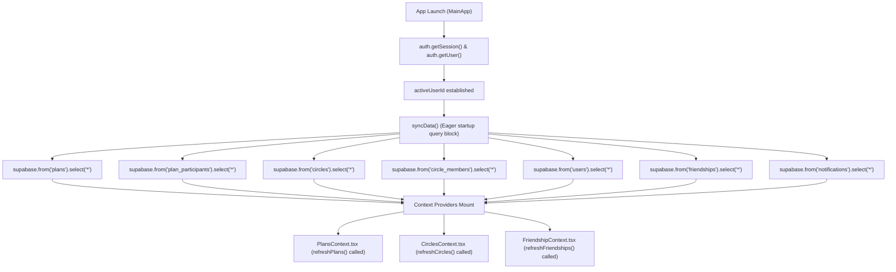
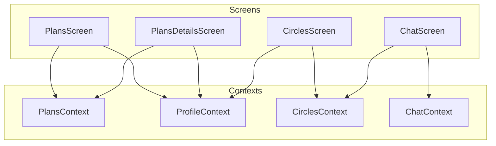

# Planless Feature Data Architecture & Migration Map

## 1. Executive Summary

This document maps out the current global-heavy data loading architecture of Planless and defines a migration path toward a feature-owned data architecture. 

Currently, Planless relies on a "Startup Hydration" model where the client fetches entire tables from Supabase at app launch. This raw, unfiltered, global-state pattern operates like a local replica of the central database, resulting in unsustainable Supabase egress (15+ GB for fewer than 30 users).

To resolve this, we will move toward a modular, feature-owned data architecture where:
* Startup queries are eliminated.
* Features load and own their respective tables.
* Database queries are scoped, paginated, and filtered by the logged-in user.
* Realtime subscriptions are filtered at the Postgres connection level using tenant/user IDs.

---

## 2. Current Startup Flow

The diagram below represents how data flows during application launch. Almost all tables are downloaded in bulk on initial mount.



---

## 3. Context Ownership Matrix

| Context / Store | Managed Data | Source Tables | Consuming Screens & Components | Load Mode | Realtime Sub? | Writes? |
| :--- | :--- | :--- | :--- | :--- | :--- | :--- |
| `ProfileContext` | `dbUsers`, `dbFriendships`, `dbCircles`, `dbCircleMembers`, `userProfile` | `users`, `friendships`, `circles`, `circle_members` | Almost all components/screens | Eager | No | Yes |
| `PlansContext` | `dbPlans`, `dbPlanParticipants`, `dbMemories` | `plans`, `plan_participants`, `memories` | `PlansScreen`, `PlansDetailsScreen`, `HomePlanDetails`, `HomePlansPreviewScreen`, `ReservationSuccessModal` | Eager | Yes | Yes |
| `CirclesContext` | `dbCircles`, `dbCircleMembers` | `circles`, `circle_members` | `CirclesScreen`, `CircleSettingsScreen`, `ChatScreen` | Eager | Yes | Yes |
| `FriendshipContext` | `friends`, `incomingRequests`, `outgoingRequests` | `friendships` | `FriendsScreen`, `FriendsSelector`, `WhoIsComingScreen` | Eager | Yes | Yes |
| `ChatContext` | `messages`, `connectionStatus` | `circle_messages` | `ChatScreen` | Lazy | Yes | Yes |
| `WalletContext` | `plansList`, `participantsList`, `walletTxs`, `circlesList` | `wallet_expenses` | `WalletScreen` | Eager | No | Yes |

---

## 4. Screen Dependency Matrix

| Screen | Consumed Contexts | Indirect Queries Triggered | Data Actually Required |
| :--- | :--- | :--- | :--- |
| `PlansScreen` | `PlansContext`, `ProfileContext` | Full fetch of plans, participants, and users | Plans where current user is host/guest |
| `PlansDetailsScreen` | `PlansContext`, `ProfileContext` | Full fetch of plans, participants, and users | Single plan details, its participants, and active user profile |
| `CirclesScreen` | `CirclesContext`, `ProfileContext` | Full fetch of circles, circle members | Circles the current user is a member of |
| `ChatScreen` | `ChatContext`, `CirclesContext` | Full fetch of messages for target room | Messages in the selected circle |
| `FriendsScreen` | `FriendshipContext`, `ProfileContext` | Full fetch of friendships, user list | Friends of the current user |



---

## 5. Supabase Query Inventory

### Plans Feature
1. **Fetch Plans**
   * **File:** `PlansContext.tsx` (`refreshPlans`) / `MainApp.tsx` (`syncData`)
   * **Table:** `plans`
   * **Operation:** `SELECT`
   * **Columns:** `*, discovery_items(category, subcategory)`
   * **Filters:** None (Loads all plans)
   * **Classification:** Startup

2. **Fetch Plan Participants**
   * **File:** `PlansContext.tsx` (`refreshPlans`) / `MainApp.tsx` (`syncData`)
   * **Table:** `plan_participants`
   * **Operation:** `SELECT`
   * **Columns:** `*`
   * **Filters:** None
   * **Classification:** Startup

### Circles Feature
1. **Fetch Circles**
   * **File:** `CirclesContext.tsx` (`refreshCircles`) / `MainApp.tsx` (`syncData`)
   * **Table:** `circles`
   * **Operation:** `SELECT`
   * **Columns:** `*`
   * **Filters:** None
   * **Classification:** Startup

2. **Fetch Circle Members**
   * **File:** `CirclesContext.tsx` (`refreshCircles`) / `MainApp.tsx` (`syncData`)
   * **Table:** `circle_members`
   * **Operation:** `SELECT`
   * **Columns:** `*`
   * **Filters:** None
   * **Classification:** Startup

### Chat Feature
1. **Fetch Messages**
   * **File:** `ChatContext.tsx` (`loadMessages`)
   * **Table:** `circle_messages`
   * **Operation:** `SELECT`
   * **Columns:** `*, sender:users!chat_messages_sender_id_fkey(id, public_id, full_name, profile_url)`
   * **Filters:** `circle_id = activeCircleId`, `limit = 50`
   * **Classification:** Lazy

---

## 6. Realtime Subscription Inventory

* **Plans Realtime:**
  * **Channel:** `"plans-realtime-sync"`
  * **Table:** `plans`, `plan_participants`, `memories`
  * **Filters:** None
  * **Callback:** In-memory updates and triggers global `refreshPlans(["plans", "plan_participants"])`.
* **Circles Realtime:**
  * **Channel:** `"public:circles_realtime"`
  * **Table:** `circles`, `circle_members`
  * **Filters:** None
  * **Callback:** In-memory updates and triggers global `refreshCircles(["circles", "circle_members"])`.
* **Friendships Realtime:**
  * **Channel:** `friendships-realtime-${activeUserUuid}`
  * **Table:** `friendships`
  * **Filters:** None
  * **Callback:** Triggers global `refreshFriendships()`.

---

## 7. Global Data Loading Inventory

The following items represent sources of excessive egress because they fetch data for all users globally:
1. **`users` Table Scan:** Hydrated globally at startup (`SELECT *`). Fetches all user rows, names, avatars, and bios.
2. **`friendships` Table Scan:** Hydrated globally at startup (`SELECT *`). Fetches all connections in the system.
3. **`plans` Table Scan:** Hydrated globally at startup. Fetches all active, past, and draft plans in the database.
4. **`plan_participants` Table Scan:** Hydrated globally at startup. Fetches all guest lists for all events.

---

## 8. Feature Ownership Proposal

We propose breaking down global context states into strictly bounded context/hook directories:

```
src/
  features/
    auth/           --> Owns current user sessions and active profile
    plans/          --> Owns plans, participants list, and memories queries
    circles/        --> Owns circles list and circle membership queries
    chat/           --> Owns message streams and room states
    friendships/    --> Owns user-scoped friendships
```

* **MainApp:** Only loads the authenticated user's profile and starts the auth listener.
* **Plans Feature:** Fetches only plans where the current user is host or participant.
* **Circles Feature:** Fetches only circles where the current user is a member.
* **Friendships Feature:** Fetches only friendships where `user_1_id = activeUserId` or `user_2_id = activeUserId`.

---

## 9. Architectural Risks

1. **Client-side Joins Broken by Scoped Loading:** Currently, the plans feature resolves guest profiles by indexing into `dbUsers` (which is populated with every user in the app). If we limit profile loading to only relevant users, inline participant names or avatars might render blank if the profile isn't fetched beforehand. We must transition to query-level Postgres joins (e.g., `.select("*, user:users(...)")`) instead of memory-mapping.
2. **Rerender Loops during Local State Syncs:** If individual screens maintain their own local hooks/subscriptions rather than sharing a single Context store, we risk spawning multiple simultaneous database listeners, which would increase connection pools and repeat redundant network requests.

---

## 10. Migration Readiness Assessment

The codebase is highly ready for refactoring. The separation of features into directories (`features/plans`, `features/circles`, etc.) is already established. Because all screens query data through React Context hooks (`usePlansStore()`, `useCirclesStore()`, `useProfileStore()`), we can rewrite the internal query logic inside these provider context files without having to touch the view layout files, ensuring 100% backwards compatibility and zero visual regressions.
